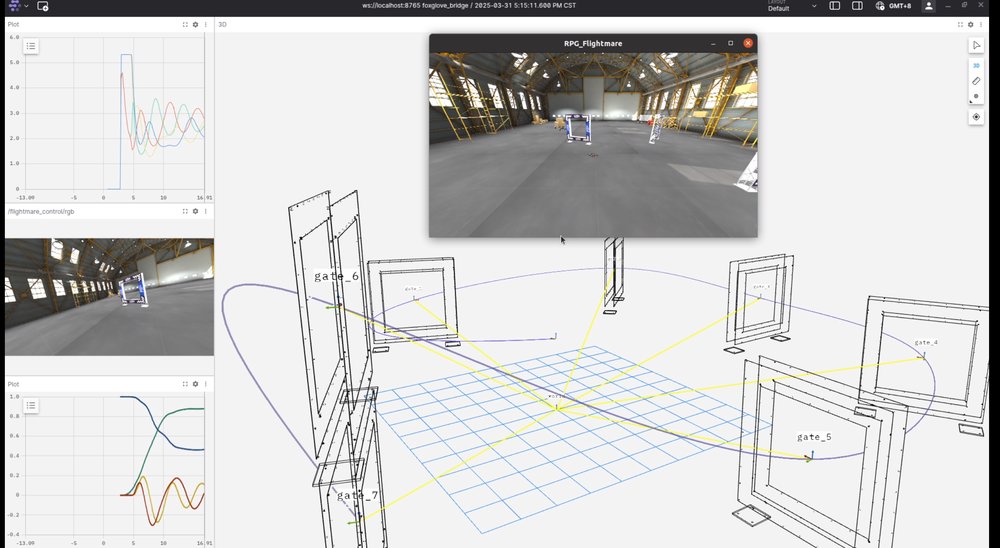
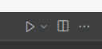

# NMPC Quadrotor Controller fot Flightmare
Here is my own page **[Page](https://jzkosann.github.io/)**

## Introduce
This project demonstrates the design and implementation of a high-performance Model Predictive Controller (MPC) for a quadrotor operating within the Flightmare simulation environment, utilizing the acados toolkit. acados facilitates the efficient solving of Optimal Control Problems (OCPs) and generates C-code suitable for embedded systems, while Flightmare provides a realistic, physics-based drone simulation environment with high-quality visualization through Unity.

The primary goal is to achieve precise and agile trajectory tracking for the quadrotor.🥳

Here is the video.👇
[](https://youtu.be/0tH68vLpp1M)

## Technology Stack

`Simulator`: **[FLightmare](https://uzh-rpg.github.io/flightmare/)**

`MPC Solver`: **[acados](https://docs.acados.org/)**

`Visualization`: Unity

## Prerequisites

It is recommended to use Ubuntu 18.04 (Melodic) or 20.04 (Noetic) with ROS installed, as some components or launch scripts might rely on the ROS environment.

`Flightmare` is a versatile quadrotor simulator. It consists of a C++ backend for physics and a Unity frontend for rendering.**[Doc](https://flightmare.readthedocs.io/en/latest/)**

`acados` is a software package for fast and embedded nonlinear model predictive control (NMPC) and moving horizon estimation (MHE).**[Doc](https://docs.acados.org/installation/index.html)**

## Project Structure
```
.
├── src/acados_racing/                      # C++ source code
│   └── acados_racing_node.cpp              # simulation setting and input drone control signal to sim
├── scripts                                 # NMPC logic using acados(python)
│   ├── controller.py                       # controller wrap (include Params)
│   ├── model.py                            # model setting
│   ├── ros_node.py                         # ros node
│   ├── path_gen.py                         # generate reference trajectory
│   └── ...
├── launch/                                 # launch file
├── README.md                               # This file
└── ...
```

## Installation & Build
Assume u have already install **[Flightmare](https://flightmare.readthedocs.io/en/latest/)**, and init **[ROS](https://www.ros.org/)** workspace.
```bash
cd src # in ur ros workspace (such as catkin_ws/src)
git clone git@github.com:JzKosann/NMPC_Flightmare.git
cd ..
catkin build -DPYTHON_EXECUTABLE=/usr/bin/python3 # This is important!
```

conda
```bash
conda create --name Flightmare_ros python=3.8.*
conda activate Flightmare_ros
```
launch the code
``` bash
# First step is run the ROS core, and Flightmare simulator.
 roslaunch acados_nmpc_controller drone_racing.launch 
# Second is run the code in editor like VSCODE, and push the button  to launch the drone.🚀🚀🚀🚀🚀
```
the button ---> 
