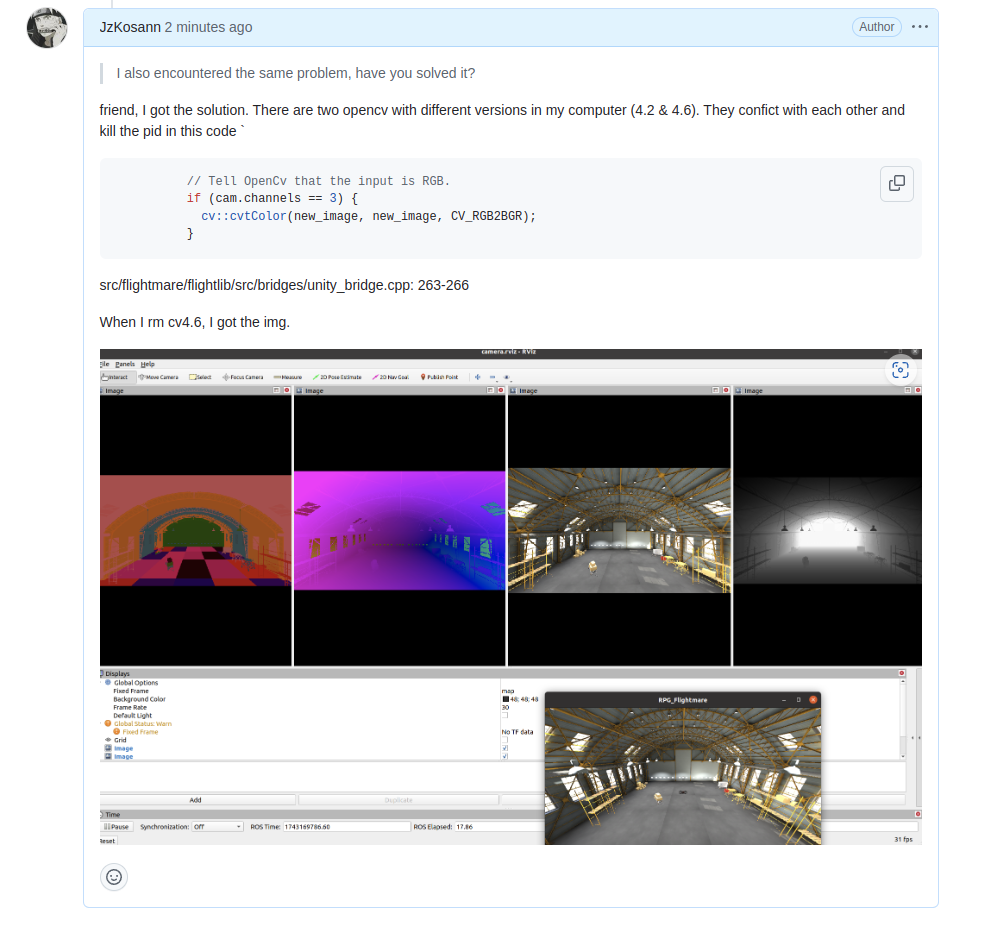

# Dev_log

## 2025.3.6

- **『ROS问题』**rosrun python 文件的时候，指定不同的python编译器
  - 由于同一系统下python过多，且python脚本可自行执行，可指定编译器执行，例如：
    `/usr/bin/python3 XXX/XXX/&&&.py`

## 2025.3.8

- 『添加了单电机的推力控制』：

  

  ```c++
  Scalar t = 0.0;
  Vector<4> thrusts{500, 500, 500, 500};
  Command cmd(t, thrusts);
  Scalar ctl_dt = 0.01;
      // 检查命令是否有效
  if (cmd.valid())
  {
      std::cout << "Command is valid." << std::endl;
  }
  	// 检查控制模式
  if (cmd.isSingleRotorThrusts())
  {
      std::cout << "Using single rotor thrusts mode." << std::endl;
      std::cout << "Thrusts: " << cmd.thrusts.transpose() << std::endl;
  }
  quad_ptr->getDynamics();
  quad_ptr->run(cmd, ctl_dt);
  ```

- 待解决问题....
  - 『NMPC控制框架』：单电机输出应该从转速到推力转换
  - 『DYNAMICS 方程』：在 `flightlib` 中找一下

## 2025.3.9

-  完善了Dynamic 方程和 `model.py`，随后需要进行测试，

  参考代码：https://github.com/LGQWakkk/Quadrotor-NMPC-Control/blob/main/export_model.py


## 2025.3.21

- 完善了无人机自旋问题，诊断为参数问题，还需要在协调一下

- 添加轨迹
  - 引入合适的轨迹，用nmpc进行跟踪
  - 尝试`minimum_snap`?（但是在flightmare中生成的轨迹没有朝向赛道门）

## 2025.3.25
- 仿真环境相机问题
  
  在开源仿真项目上提出了问题，但是没有得到回复
  
  - 解决方案：自己对赛道门重新进行建模

- 无人机自旋问题：

  - 目前姿态可以收敛，但是目标值设置为`(1,0,0,0)`，收敛在`(-1,0,0,0)`

- 位置跟踪问题：

  - 无人机姿态没有办法收敛---导致的结果是摄像头无法正对赛道门。

## 2025.3.26
- 解决无人机自旋收敛到相反姿态问题

  - 问题：在误差计算中忽略了四元数的双重覆盖性

    - 单位四元数具有“双重覆盖”（double-cover）特性——一个旋转可以由两个相反的四元数（q 和 -q）表示。在本来的NMPC控制器中，代价函数直接惩罚当前四元数状态与目标四元数`[1, 0, 0, 0]`之间的`欧几里得差值`，却没有考虑这种双重表示。这意味着，代价函数无法区分由 q 和 -q 所表示的相同方向。结果，优化器收敛到了一个“等效”的四元数`[-1, 0, 0, 0]`（这在物理意义上与`[1, 0, 0, 0]`表示相同的姿态），而不会因为符号相反而产生额外惩罚。换句话说，控制器认为已经到达了目标姿态，因为`q = -q_ref`表示相同的实际旋转，即使它们在数值上符号不同。

  - 解决方案：
  
    - 更改nmpc控制器中`cost func`对四元数的定义

    - 对参考值反转

- 重新检查无人机模型`model.py`,发现`tau_z`反了，问题解决

## 2025.3.27
- 优化参数

## 2025.3.28
- 无人机跟踪轨迹方法
  
  - 超前跟踪，提前跟踪一段轨迹序列，动作姿态比较顺滑
    - 问题：


  - 单点跟踪，跟踪到当前目标点后，自增序列数，跟踪下一个点
    - 问题：NMPC控制器一直输入阶跃信号，就会出现如下情况
      - 当无人机到当前目标点后，在没有更新新目标点的情况下会企图收敛到速度0,0,0，导致无人机动作摇晃
      ```python      
        target_pos = np.array([tar_pos[0],tar_pos[1],tar_pos[2],
                                # tar_vel[0],tar_vel[1],tar_vel[2],
                                0,0,0,
                                tar_quat[3],tar_quat[0],tar_quat[1],tar_quat[2],
                                # 1,0,0,0,
                                0,0,0])   
      ```
      
      - 解决方案：引入速度角速度目标值，全状态nmpc控制

- 解决无人机摄像头问题

  - 存在两个版本的opencv，互相冲突导致代码运行崩溃

    
    


